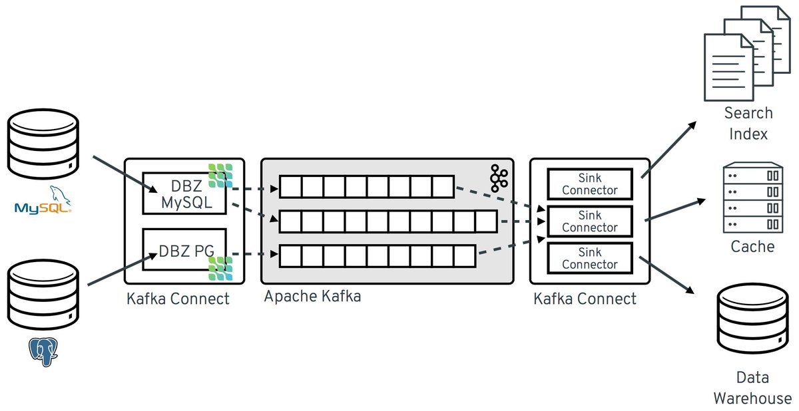

# transaction log tailing pattern w/ Debezium + Kafka

> Auth microservice implementation.

https://medium.com/trendyol-tech/transaction-log-tailing-with-debezium-part-1-aeb968d72220

> PostgreSQL database 

> SQLC
https://github.com/kyleconroy/sqlc

> Docker-compose testing, main.go will subscribe to the given topics (tables) and print events whenever the DB state changed.

> Microservices will write to own database. Debezium will automatically produce the events.

> Consumer microservices will continue to listen for events.
